<div align="center">

# InnerDesk

### Samsung DeX or Pixel desktop — on your phone.

Pair **once per boot**, tap Start desktop, and that desktop fills this screen.

<br/>

[](https://discord.gg/RJFeaetayh)
[](https://github.com/zanderp/inner-desk/releases)
[](https://ko-fi.com/alexandrupopa)

**💬 Questions or a log to share? [Join the InnerDesk Discord](https://discord.gg/RJFeaetayh).**

<br/>

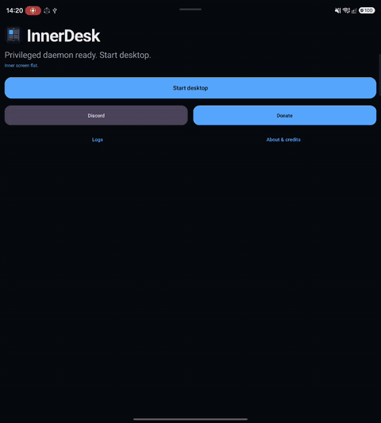

<p><sub>Galaxy Z Fold — start desktop, type, then stop. Clip is sped up.</sub></p>

<br/>

&nbsp;
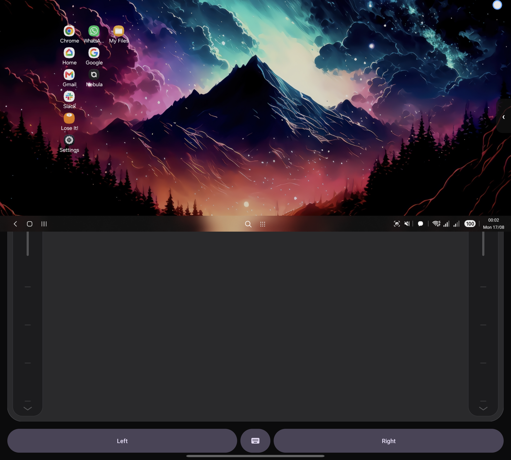&nbsp;
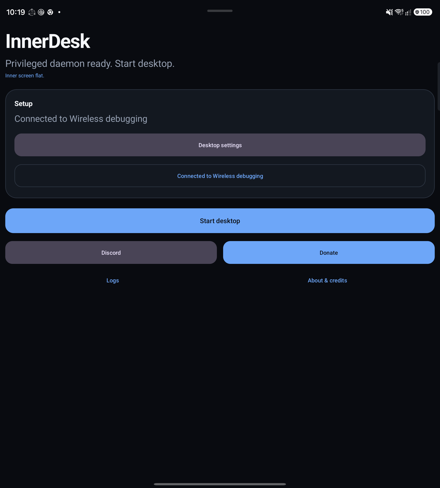&nbsp;
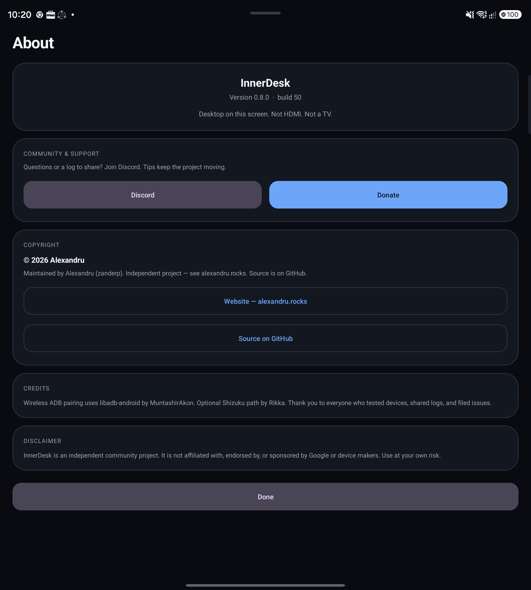

<br/><br/>

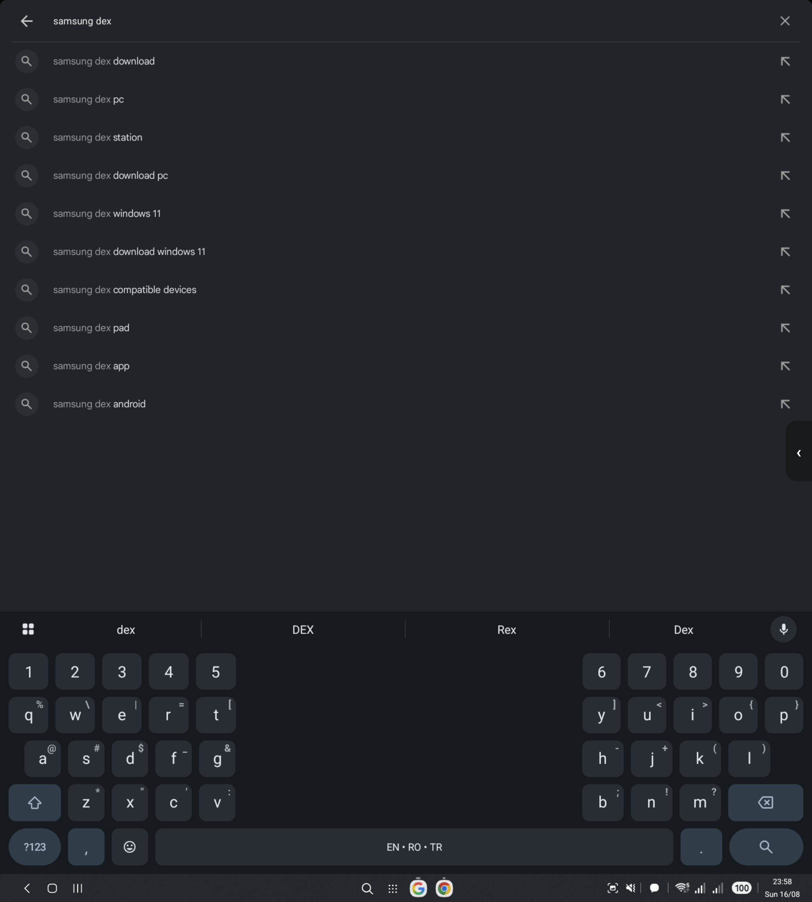&nbsp;
&nbsp;
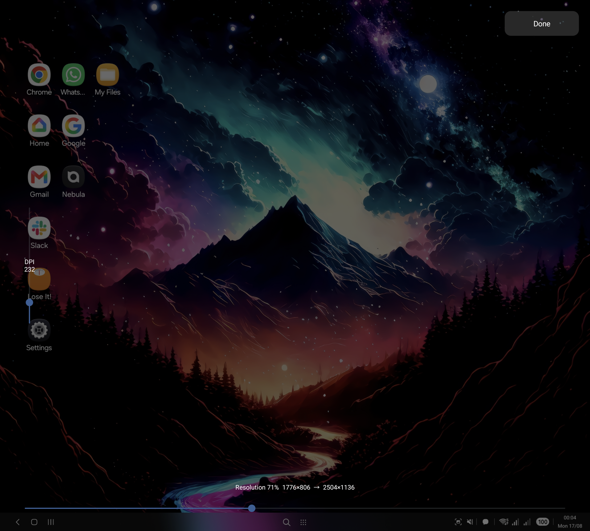&nbsp;
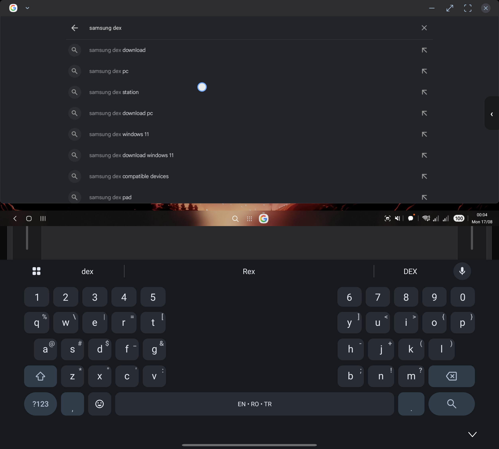

<br/><br/>

<p><sub>Same desktop on a regular phone (S25 Ultra class)</sub></p>

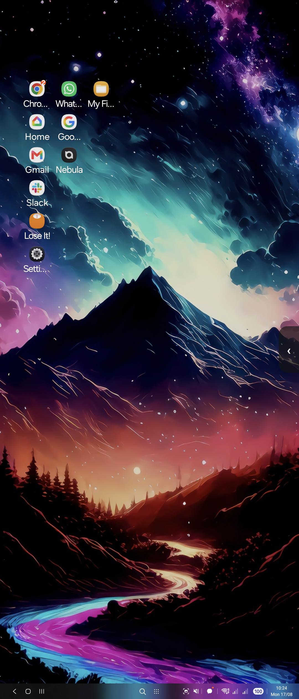&nbsp;
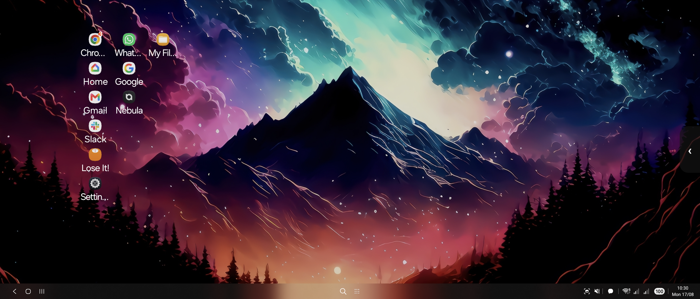

<br/><br/>

<p><sub>Quick Settings tile and home-screen widget</sub></p>

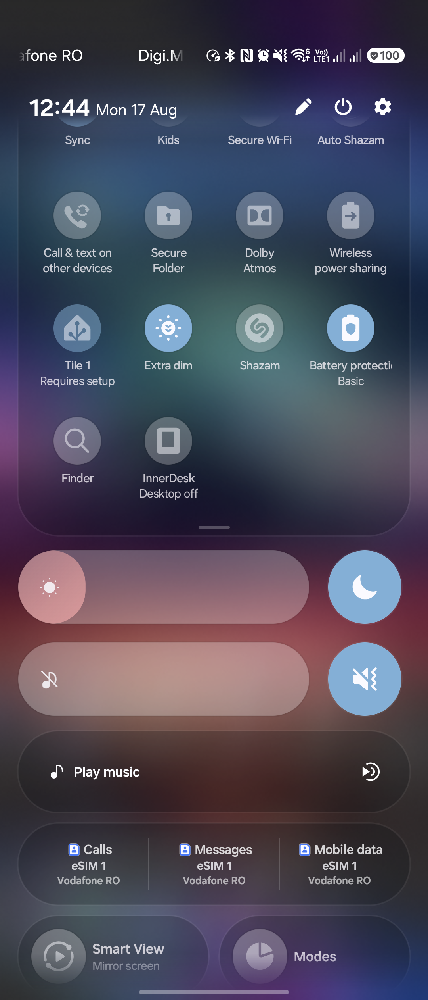&nbsp;
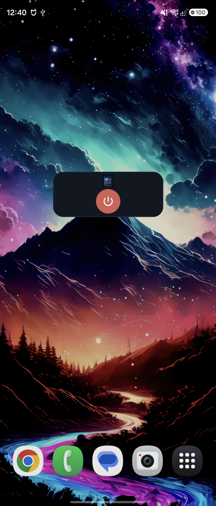

</div>

---

Independent community project. Supported today: **Pixel** (Android 16 desktop) and **Samsung** (One UI 8 DeX). Tested on Galaxy Z Fold and regular Samsung phones (S25 Ultra class). Other devices later. Use at your own risk.

---

## Features

| | |
| --- | --- |
| **Desktop on this screen** | Samsung DeX or Pixel Android 16 desktop — running on the phone itself. |
| **Quick Settings tile** | Add InnerDesk next to Wi-Fi and DeX. Tap to start or stop desktop — not a notification. |
| **Home-screen widget** | Resizable tile with the InnerDesk logo and a red power button. Same start/stop. |
| **Folds** | Unfolded, it fills the inner screen. Half-open tabletop puts the desktop on top and a trackpad on the bottom; the keyboard opens over the pad. |
| **Regular phones** | Portrait or landscape, the desktop fills the display. |
| **Trackpad** | Move, click, two-finger scroll, pinch-zoom. Two-finger tap is right click. |
| **Pair once per boot** | Wireless debugging PIN (Shizuku works too). InnerDesk keeps a privileged daemon until you reboot. |
| **Desktop settings** | DPI and resolution sliders from the overlay menu. |
| **Logs** | Built-in logs you can share when something breaks. |
| **Privacy** | Optional anonymous usage and crash reports (random id only). Off in **About → Privacy**. |

## What you need

- **Pixel** on **Android 16**, or **Samsung** on **One UI 8** (Android 16) with DeX.
- The InnerDesk APK from [Releases](https://github.com/zanderp/inner-desk/releases/latest) (F-Droid listing: see [docs/fdroid.md](docs/fdroid.md)).

No root. Other phones are not supported yet.

## One-time setup

Do this the first time you install InnerDesk. After a reboot you only **pair again** (step 6).

1. **Install** the APK and open InnerDesk.
2. **Notifications** — allow them when Android asks (Android 13+). InnerDesk uses them for pairing and the “desktop on” session.
3. **Display over other apps** — allow InnerDesk when the system screen appears. Needed for the session HUD.
4. **Unrestricted battery** — allow “Ignore battery optimizations” / unrestricted battery so the privileged daemon is not killed.
5. **Accessibility** — Settings → Accessibility → InnerDesk → turn **on**. This is what draws the desktop fullscreen (Android caps the system overlay window at 50%).
6. **Wireless debugging, once this boot**
   - Settings → Developer options → **Wireless debugging** → on.
   - Tap **Pair device with pairing code**.
   - In InnerDesk tap **Wireless debugging**, then enter the **6-digit PIN** (the pairing notification can fill it in).
   - Shizuku works as an alternative if you already use it.
7. When the app says **Privileged daemon ready**, tap **Start desktop**.

After the daemon is up you can turn Wireless debugging off. Pair again after every reboot.

Optional: pull down Quick Settings → edit → add **InnerDesk**, or long-press the home screen → Widgets → **InnerDesk desktop**.

On a regular phone the desktop fills the screen. Side arrow → Close desktop / Desktop settings / Tabletop. On a Fold, unfolded is fullscreen. Half-open tabletop keeps the desktop on the upper half, with trackpad and Left / keyboard / Right on the lower half.

<p>

</p>

## Getting help

Hit the same bug twice, share the log from the app, and drop it in **[Discord](https://discord.gg/RJFeaetayh)**.

| Symptom | Try this |
| --- | --- |
| “Currently supports Pixel and Samsung” | This phone is not a supported Pixel (Android 16) or Samsung (One UI 8) yet. |
| Still asking for Wireless debugging | Pair once this boot. Expand the pairing notification and type the PIN in InnerDesk. |
| Desktop doesn’t fill the screen | Enable InnerDesk in Settings → Accessibility. Tabletop on a Fold is the top half on purpose. |
| Pointer / clicks don’t reach the desktop | Daemon must be ready. Close desktop and start it again. |
| Want a different size or sharpness | Side arrow → **Desktop settings** (DPI + resolution). |

<div align="center">

[](https://discord.gg/RJFeaetayh)
[](https://ko-fi.com/alexandrupopa)

</div>

## Build

Most people should just grab the APK from [Releases](https://github.com/zanderp/inner-desk/releases/latest). To build it yourself:

```bat
gradlew.bat assembleRelease -x lintVitalRelease -x lintVitalAnalyzeRelease -x lintVitalReportRelease
```

APK: `app\build\outputs\apk\release\app-release.apk`

Needs JDK 17+ (Android Studio’s bundled JBR is fine) and an Android SDK (`compileSdk` 35).

## About

Maintained by **Alexandru** ([alexandru.rocks](https://alexandru.rocks)) — same person behind [OpenCfMoto](https://github.com/zanderp/open-cfmoto). **About & credits** in the app has the same info.

Tips: **[ko-fi.com/alexandrupopa](https://ko-fi.com/alexandrupopa)**.

Wireless ADB pairing uses [libadb-android](https://github.com/MuntashirAkon/libadb-android) by MuntashirAkon. Optional Shizuku path by [Rikka](https://github.com/RikkaApps/Shizuku).

Anonymous usage and crash reports use a random id on the phone — no name, no Google account. Turn them off in **About → Privacy**. Details: [PRIVACY.md](PRIVACY.md).

## License

InnerDesk is licensed under the **[GNU Affero General Public License v3.0](LICENSE)** (AGPL-3.0-or-later).
Copyright © 2026 **Alexandru** ([alexandru.rocks](https://alexandru.rocks)) and the InnerDesk
contributors. See [`NOTICE`](NOTICE) for the full copyright and attribution breakdown.

**What that means:** you're free to use, study, modify, and share the app. But if you distribute it —
or run a modified version as a network-accessible service — you **must** release your complete
corresponding source under the AGPL-3.0 and keep the copyright/attribution notices intact. **Nobody
can take InnerDesk closed-source or ship a proprietary product built on it.**

> **Why AGPL:** this is original InnerDesk code (not inherited from an AGPL upstream). AGPL-3.0 is
> still the strongest widely recognized copyleft, and it covers the telemetry Worker in this repo as
> well as APK forks. The point is to keep the project — and every fork of it — open.

### Commercial licensing

Want to use InnerDesk under terms other than the AGPL (for example, in a closed product)? Those
contributions are owned by the copyright holder and can be **separately licensed** — reach out via
[alexandru.rocks](https://alexandru.rocks) to discuss.

### Contributing

Contributions are welcome under the AGPL-3.0. By submitting a pull request you certify the
[Developer Certificate of Origin](https://developercertificate.org/) (sign commits with `git commit -s`),
agree that your contribution is licensed under the AGPL-3.0, and grant the project maintainer the right
to also offer your contribution under a separate commercial license. This keeps dual-licensing possible
without every contributor holding a veto.

InnerDesk is an independent community project. It is not affiliated with, endorsed by, or sponsored by Google or device makers. Use at your own risk.

<div align="center">

<sub>[Join us on Discord](https://discord.gg/RJFeaetayh).</sub>

</div>
